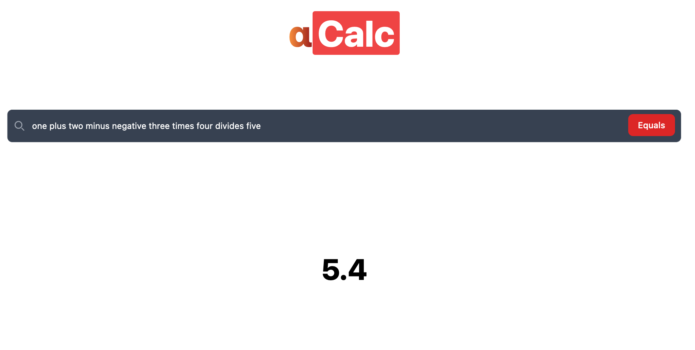

# αCalc

Built with `Typescript`, using `React.js` with `Vite`, `Tailwind CSS` with `Headless UI` & hosted on `Github Pages`!

## Screenshot


## Features
This application currently supports the addition, subtraction, multiplication and division operations over mathematical expressions involving all real numbers, written in the English language. (More operations coming soon!)

### For the mathematically inclined :)
```
    y = α(x) 
    st. 
    x is a string over the English alphabet represented by Σ, 
        defined as {{A,Z},{a,z}}, 
    α ∈ [+, -, ×, ÷] and 
    y ∈ ℝ.
 
 ```

#### Disclaimer
The code runs solely in your browser, so any queries with incomplete syntax will definitely freeze your client. This is a WIP lol